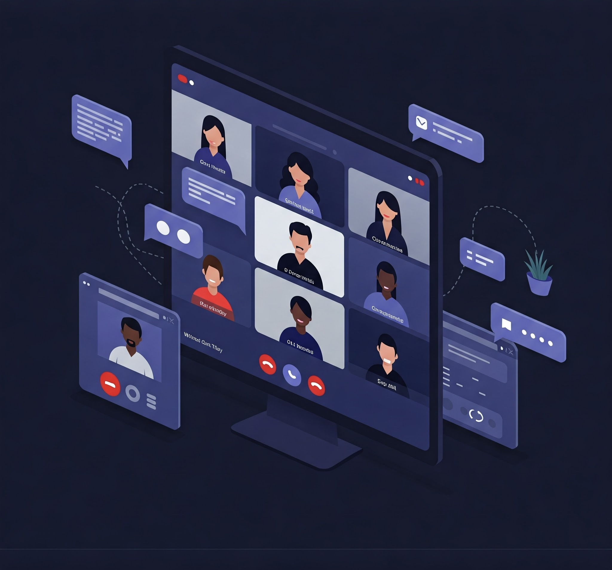

# QuickConnect - Next.js Video Conferencing App

<p align="center">
  
</p>

This repository contains a feature-heavy video conferencing application built with Next.js, leveraging the latest features for optimal performance, scalability, and maintainability. It utilizes Stream SDK for real-time video and audio communication and Clerk for secure authentication.

## Live Demo

**Live Link:** [Try the Video Conferencing App](https://quick-connect-gamma.vercel.app/)

* Click the link above to experience the application live.

## Features

* **Real-time Video and Audio Conferencing:** Powered by Stream SDK, ensuring low-latency, high-quality communication.
* **Secure Authentication:** Integrated with Clerk for robust user authentication and management.
* **Feature-Heavy Design:** Includes a wide range of conferencing features (e.g., screen sharing, various screen layouts, recording, etc.).
* **Modern UI/UX:** Designed with a focus on user experience, providing a seamless and intuitive interface.

## Next.js Features Used (Impactful Highlights)

* **Server Actions:**
    * "Experience **instantaneous data mutations** directly from your components. Server Actions eliminate the need for complex API layers, resulting in a **drastically simplified and more responsive user experience.**"
* **Server Components:**
    * "Unlock the power of **server-side rendering at a granular level.** Server Components deliver **lightning-fast initial page loads** and **reduced client-side JavaScript**, leading to **unparalleled performance and SEO benefits.**"
* **Route Groups:**
    * "Organize complex applications with **unmatched clarity and scalability.** Route Groups enable you to **logically segment your routes**, making your codebase **highly maintainable and adaptable** to future growth."
* **Custom Hooks:**
    * "Maximize code reusability and component logic separation with **powerful Custom Hooks.** These hooks encapsulate complex logic, promoting a **clean and maintainable codebase**."
* **Streaming with Stream SDK:**
    * "Leverage the power of the Stream SDK to provide **ultra low latency video and audio communication.** Create an experience that feels like everyone is in the same room."
* **Clerk Authentication:**
    * "Ensure top-tier security and a seamless user experience with Clerk. **Effortlessly manage user authentication, authorization, and profile management**, allowing you to focus on building core application features."
* **App Router:**
    * "Built using the revolutionary Next.js App Router, this application unlocks a new level of **flexibility and performance.** This router provides a powerful and intuitive way to construct complex routing logic."
* **Layouts:**
    * "Create consistent and visually appealing user experiences with Next.js layouts. This feature allows you to define shared UI elements across multiple pages, improving consistency and reducing code duplication."
* **Metadata:**
    * "Optimize your application for search engines and social media with Next.js Metadata. This feature allows you to easily manage page titles, descriptions, and other metadata, improving your application's visibility and reach."

## Technologies Used

* **Next.js (Latest Version):** React framework for building server-rendered and statically generated applications.
* **React:** JavaScript library for building user interfaces.
* **Stream SDK:** For real-time video and audio communication.
* **Clerk:** For user authentication and management.
* **Tailwind CSS:** Utility-first CSS framework for rapid UI development.
* **TypeScript:** For static typing and improved code quality.

## Getting Started

1.  **Clone the repository:**

    ```bash
    git clone [repository URL]
    ```

2.  **Install dependencies:**

    ```bash
    npm install
    # or
    yarn install
    # or
    pnpm install
    ```

3.  **Set up environment variables:**

    * Create a `.env.local` file in the root directory.
    * Add your Stream SDK and Clerk API keys:

        ```
        NEXT_PUBLIC_STREAM_API_KEY=your_stream_api_key
        NEXT_PUBLIC_CLERK_PUBLISHABLE_KEY=your_clerk_publishable_key
        CLERK_SECRET_KEY=your_clerk_secret_key
        ```

    * *You will have to get these keys from their respective websites.*

4.  **Run the development server:**

    ```bash
    npm run dev
    # or
    yarn dev
    # or
    pnpm dev
    ```

5.  **Open your browser and navigate to `http://localhost:3000`.**

## Deployment

* Instructions on how to deploy your Next.js application (e.g., Vercel, Netlify, etc.). *Add your specific deployment instructions here.*

## Contributing

* Guidelines for contributing to the project. *Add your contributing guidelines here.*

## License

* Specify the license under which the project is distributed. *Add your license information here.*
